# Practical AI Workshop

The Use of Generative AI in Teaching
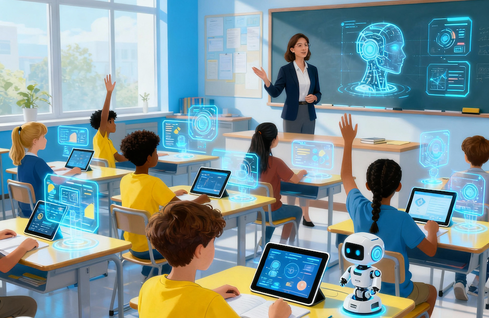

**Table of Contents**

- Introduction to Generative AI
- Popular GenAI Tools
- Texts Content Generation
- Slides Generation
- Images Generation
- Videos Generation
- Test Papers Generation
- Understanding and Using AI Agents

# What is Generative AI?


- Generative AI is a type of artificial intelligence that can **create new content**, like text, images, or music, in response to prompts from users.
- It uses machine learning models trained on large datasets (**LLM** - **L**arge **L**anguage **M**odels) to generate outputs that mimic human creativity.

# Reminders on Using AI Tools

- AI is not always correct
- AI sometimes generated false information (known as **hallucination**)
- Free AI tools may collect and use your data to train their models
- Generative AI tools updates frequently, so features may change

# Applications in Education

- **Content Creation**: Generate lesson plans, quizzes, and educational materials quickly.
- **Personalized Learning**: Tailor educational content to individual student needs and learning styles.
- **Language Learning**: Assist with translations, grammar checks, and language practice.
- **Research Assistance**: Help students and educators find information and summarize complex topics.
- **Creative Projects**: Support students in creating art, music, and writing projects.
- **Administrative Tasks**: Automate routine tasks like grading and scheduling.

# Categories of GenAI Tools

- ✍ **Text**: ChatGPT, Gemini, Gopilot, POE, DeepSeek, CHATPDF, 通義, 文心一言, 訊飛星火
- 🖼️ **Images**: Gemini, Canva, Microsoft Designer, DALL-E, Midjourney, Stable Diffusion
- 🎥 **Video**: Gemini, Sora, Synthesia, Pictory, Runway
- 🎶 **Audio**: Descript, Audo, Podcastle
- 💬 **Meeting**: Otter.ai, Fireflies, Fathom
- **Others**: Copy.ai, Jasper, Writesonic

**Multimodal generative AI** is a type of artificial intelligence that can understand and create content across multiple types of data—called “modalities”—such as text, images, audio, video, and even sensor data. Unlike traditional AI models that only handle one kind of input (like just text or just images), multimodal generative AI can combine different inputs and generate outputs in one or more formats.

# Texts Generation

## Tools

- Gemini (https://gemini.google.com/)
- Copilot (https://copilot.microsoft.com/)
- DeepSeek (https://www.deepseek.ai/)
- Perplexity (https://www.perplexity.ai/)
- POE (https://poe.com/)

## Writing Effective Prompts

To write effective prompts for texts generation, consider the following elements:

- **Task** (must)
- **Persona** (optional)
- **Context** (optional)
- **Format** (optional)

## Examples

**❌ Bad Prompt**: DOESN'T specify any of the elements above.

`What is Generative AI?`

**✅ Good Prompt**: specifies SOME or ALL of the elements above.

### Example #1

| Element                                               |                  | Example                                                                                                                                                 |
| ----------------------------------------------------- | ---------------- | ------------------------------------------------------------------------------------------------------------------------------------------------------- |
| **Persona** <br>**Task**<br>**Context**<br>**Format** | →<br>→<br>→<br>→ | Act as a school teacher, <br>explain what Generative AI is <br>to primary school students with little computer knowledge. <br>Use bullet points format. |

### Example #2

| Element                                               |                  | Example                                                                                                            |
| ----------------------------------------------------- | ---------------- | ------------------------------------------------------------------------------------------------------------------ |
| **Persona** <br>**Task**<br>**Context**<br>**Format** | →<br>→<br>→<br>→ | 向初中生 <br>解釋什麼是生成式 AI。<br>介紹市面上受歡迎的 AI 工具及其類別，並切實收費形式及數據保護條款。 <br> <br> |

### Example #3

| Element                                       |             | Example                                                                 |
| --------------------------------------------- | ----------- | ----------------------------------------------------------------------- |
| **Format** <br>**Task**<br>**PersonaContext** | →<br>→<br>→ | 以 3 點交代 <br>使用生成式 AI 引致的數據安全問題<br>受眾為初中學生 <br> |

### Example #4

| Element                                 |              | Example                                                                                                  |
| --------------------------------------- | ------------ | -------------------------------------------------------------------------------------------------------- |
| **Task** <br>**Format**<br> **Context** | →<br>→ <br>→ | 將以下內容生成摘要<br>字長一百字<br> https://zh.wikisource.org/zh-hant/%E9%98%BFQ%E6%AD%A3%E5%82%B3 <br> |

# Slides Generation

### Use Gemini to generate texts contents

| Element                                               |                  | Example                                                                                                            |
| ----------------------------------------------------- | ---------------- | ------------------------------------------------------------------------------------------------------------------ |
| **Persona** <br>**Task**<br>**Context**<br>**Format** | →<br>→<br>→<br>→ | 向初中生 <br>解釋什麼是生成式 AI。<br>介紹市面上受歡迎的 AI 工具及其類別，並切實收費形式及數據保護條款。 <br> <br> |

You can export the generated text to Google Docs, then copy the content to Google Slides.

```
用以下內容，生成10頁的Power Point簡報，向沒有電腦背景的初中生解釋什麼是生成式AI。
```

## Microsoft Copilot can do the same task

You can also use Microsoft Copilot to complete the this task in similar way.

# Images Generation

## Tools

- Gemini (https://gemini.google.com/)
- visualgpt (https://visualgpt.io)
- perplexity (https://www.perplexity.ai/)

## Writing Effective Prompts

To write effective prompts for images generation, consider the following elements:

- Subject
- Background/Scene
- Adjective
- Style
- Lighting

## Examples

**❌ Bad Prompt**: DOESN'T specify any of the elements above.  
`Generate a picture of a cat`


**✅ Good Prompt**: specifies SOME or ALL of the elements above.
| Element | | Example
|----------|----|---------------|
| **Subject** <br>**Background**<br>**Adjective**<br>**Style**<br>**Lighting** | →<br>→<br>→<br>→<br>→| Generate a picture of a cat <br> sitting on a sofa. Behind is a window with curtain. <br>The cat is white. <br>Make the style realistic. <br>Use dramatic lighting.|


**✅ Good Prompt**: specifies SOME or ALL of the elements above.
| Element | | Example
|----------|----|---------------|
| **Subject** <br>**Background**<br>**Adjective**<br>**Style**<br>**Lighting** | →<br>→<br>→<br>→<br>→| 以動漫風格 <br>生動圖片解釋 <br>什麼是杯弓蛇影 <br>|

**Applying camera language to the prompt**

```
a little girl, facing camera, reaching out to an apple on a coffee table.
```


```
a little girl, facing camera, reaching out to an apple on a coffee table. use wide angle effect so that the apple appears very large on screen.
```


```
a little girl, facing camera, reaching out to an apple on a coffee table. top camera view.
```

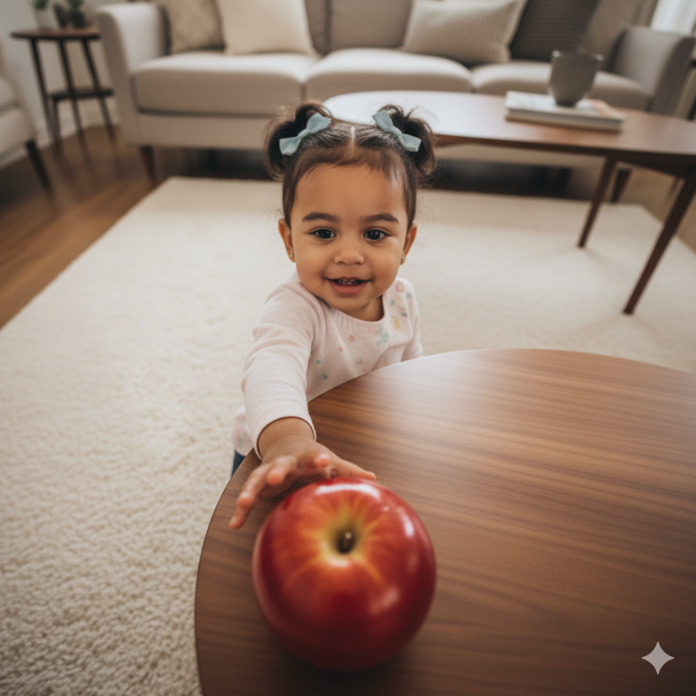

```
a little girl, facing camera, reaching out to an apple on a coffee table. low camera view.
```


## The Popular Nano Banana 3D Character Prompt

```
Turn this photo into a character figure. Behind it, place a figure box with the character image printed on it, and a computer showing the Blender modeling process on its screen. In front of the box, add a round plastic base with the figure placed on it. using the figure's vinyl material. set the scene in home studio
```


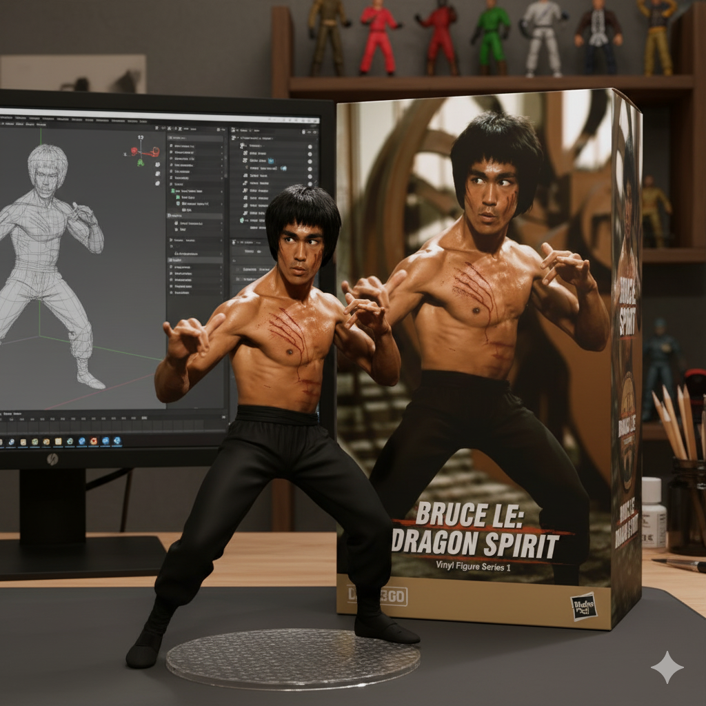

## Using visualgpt

[VisualGPT](https://visualgpt.io)

- Background Remover
- AI Room Cleaner

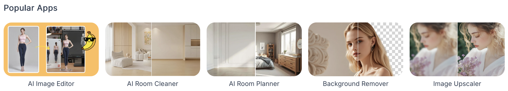

### More Tips on Images Generation

[Gemini Images Generation Tips](https://cloud.google.com/vertex-ai/generative-ai/docs/image/img-gen-prompt-guide?hl=en&_gl=1*1d1nmdp*_ga*NDYzNTcyOTM0LjE3NDkxMzcyMTk.*_ga_WH2QY8WWF5*czE3NTk2NzY4ODAkbzEwMyRnMSR0MTc1OTY3NzEzNyRqNjAkbDAkaDA.)

# Videos Generation

Video generation is still in early stage. Video generation tools consume more computing resources and it takes longer time to generate videos.

## Tools

- Google Veo (https://cloud.google.com/vertex-ai/generative-ai/docs/video/overview)
- OpenAI Sora (https://openai.com/sora/)

### Demonstration using Vertex AI Studio on Google Cloud Platform

[Google Cloud Platform](https://console.cloud.google.com/)


Use the following prompt

```
Pancakes with maple syrup, cinematic food advertisement b-roll, dynamic.
```

Video Generation Using Veo
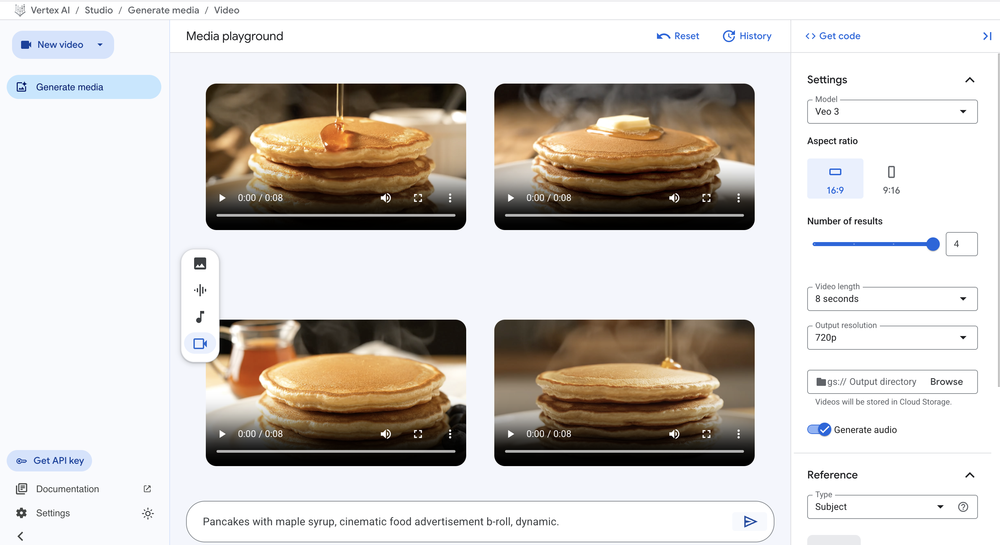

### More Video Demo Prompts

```
Hong Kong Causeway Bay, pedestrians walk on busy street, cinematic, dynamic.
```

```
Hong Kong Victoria Harbour at sunset, cinematic,  dynamic.
```

**Tips on Video Generation**:  
One must master visual language to write effective prompts for video generation. Here are some useful resources to learn visual language.

[Visual Language Guide by Google](https://cloud.google.com/vertex-ai/generative-ai/docs/video/video-gen-prompt-guide?hl=en)

# Test Papers Generation

**Prompt**: Use the following prompts in AI chatbot such as Gemini to generate a test paper.

```
以岳飛滿江紅為題，生成一份包含5題選擇題的測驗試卷，並附上答案。每題2分。
```

```
以唐詩宋詞為題，生成一份包含5題選擇題的測驗試卷，並附上答案。每題2分。
```

```
以二次方程式為題，生成一份包含5題選擇題的測驗試卷，並附上答案。每題2分。
```

```
以香港歷史古跡為題，生成一份包含5題選擇題的測驗試卷，並附上答案。每題2分。
```

```
以岳飛滿江紅為題，生成一份包含5題填充題的測驗試卷，並附上答案。每題2分。
```

```
以岳飛滿江紅為題，生成一份包含5題選擇題，每題1分；5題填充題，每題2分和2題簡答題，每題5分的測驗試卷，並附上答案。
```

# Google Form Script Generation

**Prompt**:

```
以香港歷史古跡為題，生成一份包含5題選擇題的測驗試卷，並附上答案。使用Google Apps Script以生成Google Form quiz。
```

```
以唐詩宋詞為題，生成一份包含5題選擇題的測驗試卷，並附上答案。使用Google Apps Script以生成Google Form quiz。
```

```
以岳飛滿江紅為題，生成一份包含5題選擇題的測驗試卷，並附上答案。使用Google Apps Script以生成Google Form quiz。
```

```
Use the following contents to create a Google Form quiz.  Generate Google Apps Script.
```

# Understanding and Using AI Agents

- AI agents are autonomous systems that can perform tasks, make decisions, and interact with their environment using artificial intelligence techniques.
- In Gemini, AI agents are called **Gems**. They can do tasks on behalf of users, such as answering questions, providing recommendations, or automating workflows.

## Exploring Gemini Gems

In Gemini, from collapse menu, select **Explore Gems**

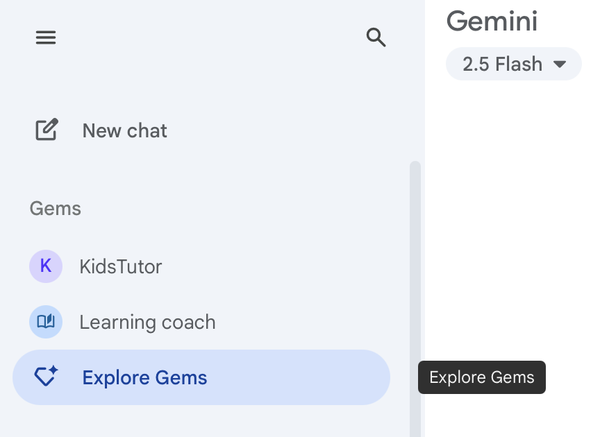

## Premade Gems by Google

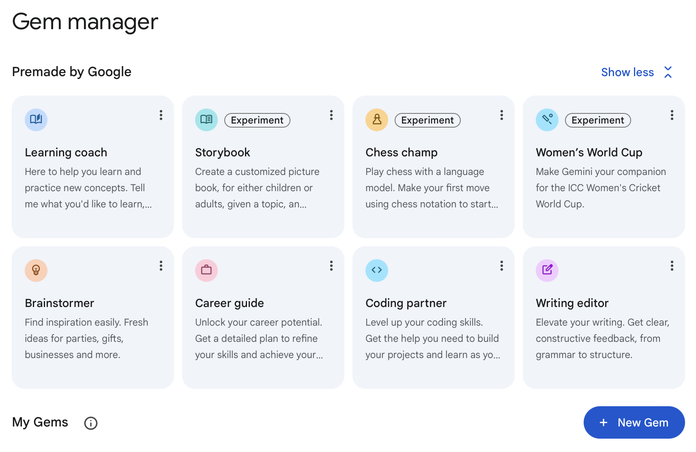

## Let's Use **Storybook** to make a children's stories

```
以"杯弓蛇影"創造一個兒童圖書故事
```

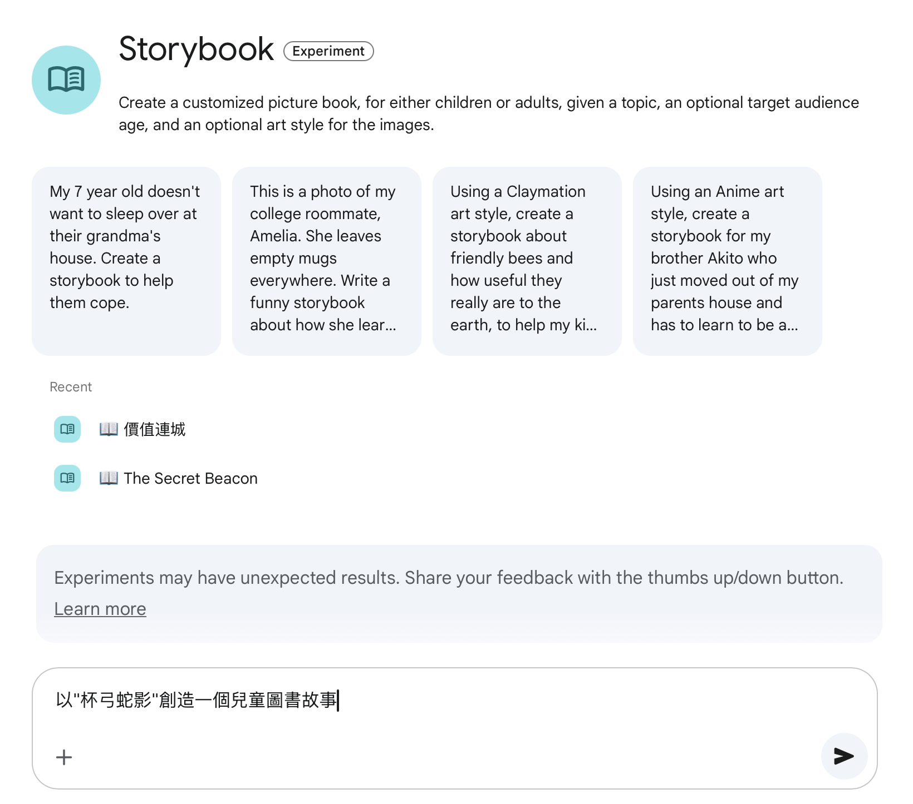

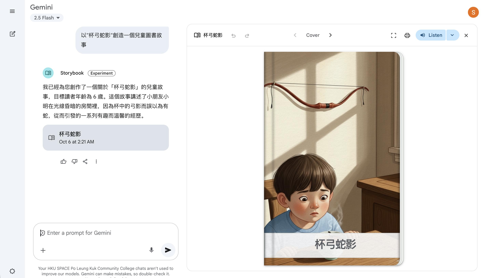

```
A teenage named Leo is super hero fan.  After a car accident, he discovers he has super powers.  Write a children's story book for primary school students about Leo's adventure to learn how to use his super powers to save people in danger.
```


## Create your own Gem

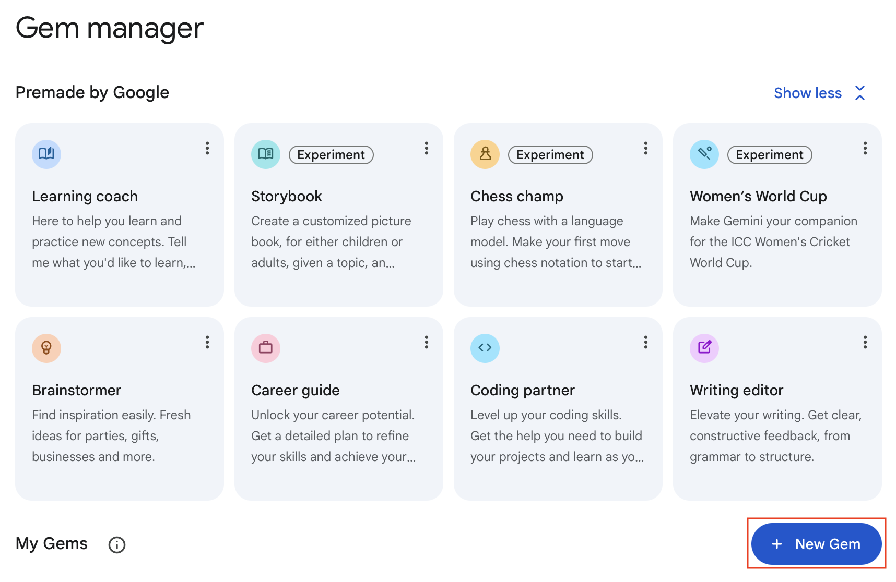

**Name your Gem**

```
KidsTutor
```

**Instructions to your Gem**

```
You are a tutor for kids. You will explain things in simple terms that kids can understand.
```

**Write the following prompts to interact with your Gem.**

```
什麼是雲計算？
```

```
誰是魯迅？
```

# HKU Suggested GenAI Tools

[GenAI Tools Listing for Teaching & Learning](https://aied.talic.hku.hk/genaitools/)

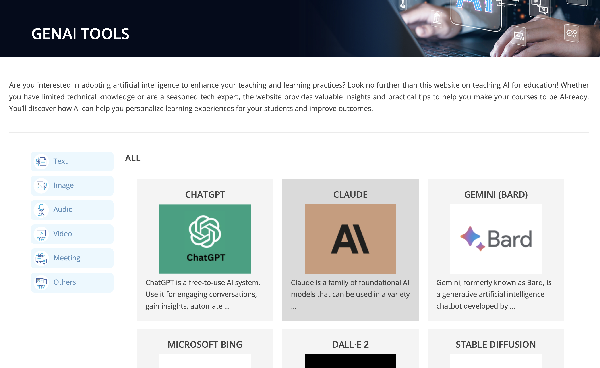
